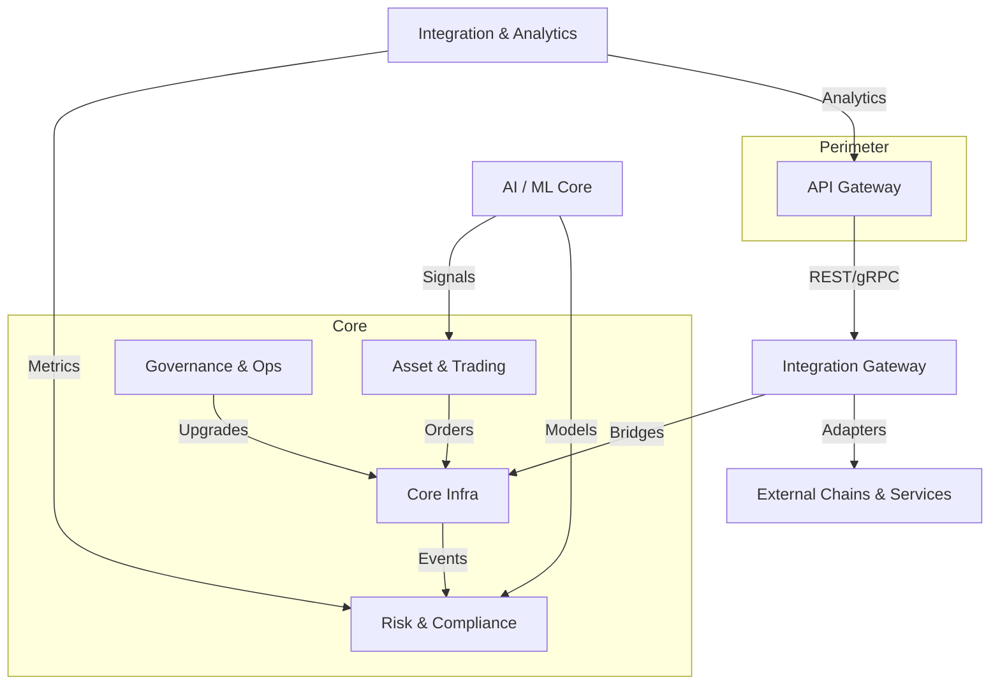
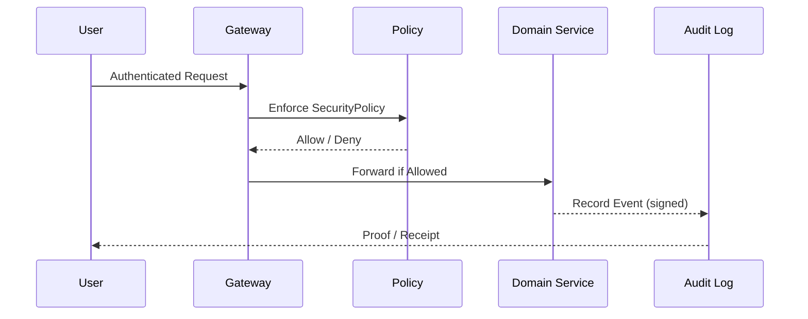

# VeritasVault – High-Level Architecture Overview  

> **Single Source of Truth for Platform Architecture**

---

## 1. Executive Summary  

VeritasVault (VV) is a modular, institution-grade DeFi platform engineered for **security, auditability, and regulatory compliance** without sacrificing composability or performance.  
The architecture is divided into eight discrete **artifacts** that map directly to business capabilities while enforcing strict Domain-Driven-Design (DDD) boundaries.  
Cross-cutting controls (security, audit, monitoring, compliance) apply uniformly to every layer, enabling zero-trust operations and rapid institutional onboarding.

---

## 2. Architectural Artifacts  

| # | Artifact | Purpose | Core Components |
|---|----------|---------|-----------------|
| 1 | **Core Infrastructure** | Chain security, consensus, finality | ConsensusManager, ChainIndexer, RandomnessOracle, GasController |
| 2 | **Risk, Compliance & Audit** | Automated risk analytics & immutable audit | RiskModel, ComplianceManager, AuditLogger |
| 3 | **Asset, Trading & Settlement** | Asset lifecycle, AMM trading, atomic settlement | Portfolio, Asset, OrderBook, SettlementController |
| 4 | **Integration, Analytics & Access** | Bridges, oracles, analytics, API perimeter | Bridge, PriceOracle, AnalyticsEngine, APIGateway |
| 5 | **Governance, Ops & Custody** | DAO governance, upgrades, treasury & custody | GovernanceController, Treasury, UpgradeController |
| 6 | **AI / ML Core** | Secure, auditable AI for risk & optimization | ModelRegistry, ModelDeploymentController, FairnessController |
| 7 | **Integration Gateway** | External adapter & message routing hub | APIGateway, AdapterManager, MessageBus |
| 8 | **Cross-Cutting Concerns** | Security, monitoring, DR, compliance baseline | SecurityPolicy, AuditLog, RecoveryPlan |

---

## 3. Cross-Cutting Concerns  

* **Zero-Trust Security** – MFA, circuit breakers, rate-limits enforced at every boundary  
* **Immutable Audit Logging** – All state changes cryptographically signed & versioned  
* **Continuous Compliance** – Automated SOC2 / ISO 27001 checks in CI/CD and runtime  
* **Observability & SLOs** – Unified metrics, alerting, and incident playbooks  
* **Disaster Recovery** – Hot-standby replicas, tested backup/restore with defined RPO/RTO  

---

## 4. Integration Patterns  

* **Hexagonal Ports & Adapters** – External systems interact via adapters implementing domain ports  
* **Event-Driven Messaging** – Domain events published to MessageBus / EventGrid for loose coupling  
* **API Gateway Pattern** – Single perimeter (REST/OpenAPI + gRPC) with auth, throttling, monitoring  
* **Bridge / Oracle Abstraction** – Cross-chain transfers and price feeds encapsulated behind stable interfaces  
* **Data Lake Ingestion** – All on/off-chain data streamed into immutable DataLake for analytics & ML  

---

## 5. Security & Compliance Approach  

1. **Defense-in-Depth** – Layered controls from perimeter to smart-contract level  
2. **Policy as Code** – SecurityPolicy aggregates enforced by middleware & on-chain guards  
3. **Immutable Audit** – `AuditLog` aggregate written on every privileged action; verified via Merkle proofs  
4. **Automated Attestation** – CI pipelines execute compliance suites (SOC2, GDPR, MiCA) before deploy  
5. **Human-in-the-Loop** – Multi-sig approvals and time-locks for high-risk operations  

---

## 6. Deployment Phases & Timeline  

| Phase | Target Date | Key Deliverables | Domains |
|-------|-------------|------------------|---------|
| **1 – Foundation** | 07 Jun 2025 | Core Infra baseline, Risk logging, Cross-cutting security framework | 1,2,8 |
| **2 – Connectivity** | 24 Jun 2025 | Asset & Trading MVP, Integration Gateway, Price Oracle | 3,4,7 |
| **3 – Governance & AI** | 10 Jul 2025 | DAO governance, treasury ops, AI model registry & deployment | 5,6 |
| **Post-MVP** | >Jul 2025 | Advanced LP, cross-chain settlement, continuous compliance, chaos engineering | All |

---

## 7. Glossary (Excerpt)

| Term | Definition |
|------|------------|
| **Artifact** | Primary architectural building block representing a bounded context |
| **Circuit Breaker** | Emergency halt mechanism triggered by predefined risk thresholds |
| **DataLake** | Immutable storage for historical on/off-chain data used by analytics & ML |
| **Hexagonal Architecture** | Pattern enforcing inward dependencies to domain core |

---

## 8. Change Log  

| Version | Date | Author | Notes |
|---------|------|--------|-------|
| 1.0.0 | 2025-05-30 | Factory Assistant | Initial consolidated architecture document |

---
