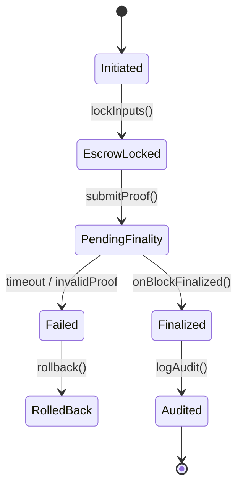

# VeritasVault Asset Domain – **Settlement Protocol Design**

> Canonical specification for deterministic, auditable, and cross-chain settlement of asset trades within VeritasVault.  
> All modules that perform value transfer **MUST** comply with this protocol.

---

## 1. Overview & Objectives

The Settlement Protocol guarantees that every matched trade or portfolio re-balance reaches **atomic, irreversible finality** while preserving solvency, auditability, and regulatory compliance across single-chain and cross-chain contexts.

**Objectives**

1. **Atomicity** – Either _all_ legs of a trade settle or _none_ do.  
2. **Deterministic Finality** – Settlement is confirmed only after Core Infrastructure attests chain finality (`BlockFinalized`).  
3. **Composability** – Uniform interfaces for spot, derivatives, and liquidity-pool exits.  
4. **Cross-Chain Reach** – Safe bridging of value with cryptographic proofs.  
5. **Auditability** – Every state transition emits signed events per [`../../SECURITY.md`](../../SECURITY.md).  
6. **Resilience** – Built-in rollback & dispute flows for partial failures or malicious behaviour.

---

## 2. Atomic Settlement Guarantees

| Guarantee | Mechanism |
|-----------|-----------|
| **All-Or-Nothing** | Two-phase commit mediated by `SettlementController`; on failure, `Rollback` event triggers full reversal. |
| **Double-Spend Prevention** | Inputs locked in escrow (HTLC / time-lock) before confirmation. |
| **Sequence Enforcement** | Monotonic nonce per portfolio + Merkle proof inclusion prevents replay / re-ordering. |
| **Idempotency** | `settlementId` (`bytes32`) referenced in all events; duplicates rejected. |

---

## 3. Settlement Lifecycle & States

| State | Description | Timeout |
|-------|-------------|---------|
| **Initiated** | Trade matched; settlement record created. | N/A |
| **EscrowLocked** | Assets moved to escrow contracts. | 15 min |
| **PendingFinality** | Await chain finality & external proofs. | Chain finality depth (e.g., 12 blocks) |
| **Finalized** | Core infra emits `BlockFinalized`; state becomes immutable. | — |
| **Audited** | Record persisted in AuditLog; compliance checks run. | ≤ 60 s |
| **Failed / RolledBack** | Automatic rollback executed. | Immediate |

---

## 4. Cross-Chain Settlement Mechanisms

Component | Role
----------|-----
**BridgeAdapter** | Generates & verifies SPV / light-client proofs.
**LockBox** | HTLC holding escrow on destination chain.
**Relayer Set** | Permissioned `ROLE_RELAYER` signers submit proofs, slashed on fraud.
**ChainAdapter** | Abstracts per-chain gas, fee, and nonce semantics.

Flow:

1. Source chain: `BridgeAdapter.lock()` transfers asset to `LockBox` + emits `TransferLocked`.
2. Relayer submits proof to destination `BridgeAdapter.release()` within time-window.
3. Destination `SettlementController` moves asset to beneficiary, emits `TransferSettled`.
4. Source chain confirms `BlockFinalized`; `LockBox` burns escrowed tokens.

---

## 5. Finality Confirmation Requirements

| Asset Type | Chain | Finality Depth | Additional Checks |
|------------|-------|----------------|-------------------|
| ERC-20 / Native | Ethereum L2 | 12 blocks | Gas ≥ minGasPrice |
| Cosmos IBC | Cosmos Hub | 2 blocks | Tendermint signature set |
| Substrate | Polkadot | GRANDPA finality | — |
| Optimistic Rollup | OP Stack | 7 days challenge window | Fraud proof observation |

`SettlementController` queries `IConsensusRepository.isFinalized()` before moving state from **PendingFinality** → **Finalized**.

---

## 6. Settlement Failure Handling & Rollback

Failure Scenario | Action
-----------------|--------
_Timeout before finality_ | `SettlementTimedOut` event → automatic `Rollback`.
_Invalid proof / fraud_ | `SettlementInvalid` → lock breaker, notify SecOps, `Rollback`.
_Insufficient balance_ | Transaction reverted pre-escrow; no state change.
_Contract pause_ | If `SecurityController.isPaused()` = true, new settlements denied; in-flight remain until resumed or rolled back.

`Rollback` returns assets to original owners, releases HTLC funds, and logs incident severity **P2**.

---

## 7. Dispute Resolution Procedures

1. **Raise Dispute** – Participant calls `raiseDispute(settlementId, evidence)` (bond required).  
2. **Arbitration Window** – 24 h; `DisputeManager` collects evidence & model outputs (fraud classifiers).  
3. **Verdict** – Multi-sig arbitrators (`ROLE_ARBITER`) decide: _Uphold_ (rollback) or _Dismiss_ (finalize).  
4. **Penalties** – Losing party bond slashed; malicious relayers slashed & blacklisted.  
5. **Audit Trail** – `DisputeResolved` logged with Merkle proof.

---

## 8. Integration Points

| System | Interaction |
|--------|-------------|
| **Core Infrastructure** | Provides finality via `BlockFinalized`; consumes `SecurityIncidentDetected`. |
| **Risk & Compliance** | Monitors settlement size vs portfolio limits; triggers circuit breakers. |
| **Audit System** | Receives `SettlementFinalized`, `SettlementRolledBack`, `DisputeResolved` events. |
| **Analytics Engine** | Streams settlement KPIs (latency, volume) for dashboards. |

---

## 9. Performance & Scalability

Metric | Target
-------|-------
Throughput | ≥ 1 000 settlements / s burst, 200 sustained
p95 Latency (single-chain) | ≤ 5 s from `Initiated` → `Finalized`
p95 Latency (cross-chain L2→L1) | ≤ 120 s (proof generation dominated)
Storage Footprint | ≤ 300 bytes per settlement log
Gas Cost (ERC-20 swap) | ≤ 220 k gas

Horizontal scaling via sharded `SettlementQueue` topic; stateless workers.

---

## 10. Security Considerations

All controls from [`../../SECURITY.md`](../../SECURITY.md) apply.  
Additional domain-specific measures:

* **Re-Entrancy Guards** in escrow contracts.
* **Circuit Breakers** on abnormal settlement velocity / slippage.
* **Time-Locked Upgrades** – 48 h notice for settlement contracts.
* **Front-Running Mitigation** – Off-chain match → on-chain commit-reveal scheme.

---

## 11. Audit & Compliance

* **Immutable Audit** – `SettlementFinalized`, `SettlementRolledBack` events signed & hash-chained.
* **Regulatory Reports** – MiFID II / MiCA daily settlement reports auto-generated.
* **SOC2 Controls** – Evidence mapped to CC7.2 (change mgmt) & CC5.4 (transaction integrity).
* **GDPR** – Personally identifying fields excluded from on-chain logs; stored only in encrypted off-chain indices.

---

## 12. Change Log

| Version | Date | Author | Notes |
|---------|------|--------|-------|
| 1.0.0 | 2025-05-30 | Factory Assistant | Initial draft – fulfils #P0 missing doc |

---
