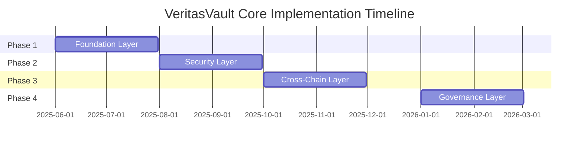

# VeritasVault Core Infrastructure - 4 Phase Implementation Plan

## Phase 1: Foundation Layer

> Timeline: Q2 2025 (June-July)

### Core Components

#### ConsensusManager

  ```solidity
  interface IConsensusManager {
      function finalizeBlock(bytes32 blockHash) external;
      function validateConsensus(bytes32 blockHash) external returns (bool);
      function getConsensusState() external view returns (ConsensusState);
  }
  ```

#### ChainIndexer

  ```solidity
  interface IChainIndexer {
      function indexBlock(Block memory block) external;
      function getSnapshot(uint256 blockNumber) external view returns (bytes32);
      function getCurrentIndex() external view returns (uint256);
  }
  ```

### Deliverables

1. Basic consensus mechanism
2. Block indexing and retrieval
3. Core data structures
4. Basic event system

### Success Criteria

- [ ] Successful block finalization
- [ ] Accurate chain indexing
- [ ] Basic event emission
- [ ] Unit test coverage >90%

## Phase 2: Security & Control Layer

> Timeline: Q3 2025 (August-September)

### Security & Control Components

#### SecurityController

  ```solidity
  interface ISecurityController {
      function updateSecurityConfig(SecurityConfig memory config) external;
      function reportIncident(SecurityIncident memory incident) external;
      function getSecurityStatus() external view returns (SecurityStatus);
  }
  ```

#### RateLimiter

  ```solidity
  interface IRateLimiter {
      function checkLimit(address user, bytes32 operation) external returns (bool);
      function updateLimit(bytes32 operation, uint256 maxRequests) external;
      function getLimitStatus(address user, bytes32 operation) external view returns (RateLimit);
  }
  ```

#### GasController

  ```solidity
  interface IGasController {
      function updateGasPolicy(GasPolicy memory policy) external;
      function calculateFee(uint256 gasUsed) external view returns (uint256);
      function getCurrentPolicy() external view returns (GasPolicy);
  }
  ```

### Security & Control Deliverables

1. Security monitoring system
2. Rate limiting implementation
3. Gas economics framework
4. Emergency shutdown mechanism

### Security & Control Success Criteria

- [ ] Security incident detection
- [ ] Effective rate limiting
- [ ] Gas price stability
- [ ] Emergency procedures tested

## Phase 3: Cross-Chain & Oracle Layer

> Timeline: Q4 2025 (October-November)

### Cross-Chain & Oracle Components

#### ChainAdapter

  ```solidity
  interface IChainAdapter {
      function registerChain(ChainConnection memory connection) external;
      function sendCrossChainMessage(uint256 targetChain, bytes memory message) external;
      function receiveCrossChainMessage(uint256 sourceChain, bytes memory message) external;
  }
  ```

#### RandomnessOracle**

  ```solidity
  interface IRandomnessOracle {
      function requestRandomness(bytes32 seed) external returns (bytes32);
      function fulfillRandomness(bytes32 requestId, uint256 randomness) external;
      function getLatestRandomness() external view returns (uint256);
  }
  ```

### Cross-Chain & Oracle Deliverables

1. Cross-chain messaging
2. VRF implementation
3. Oracle integration
4. Multi-chain support

### Cross-Chain & Oracle Success Criteria

- [ ] Cross-chain message delivery
- [ ] Verifiable randomness
- [ ] Oracle reliability
- [ ] Multi-chain operations

## Phase 4: Governance & Upgrade Layer

>Timeline: Q1 2026 (January-February)

### Governance & Upgrade Components

#### ForkManager

  ```solidity
  interface IForkManager {
      function scheduleFork(ForkConfig memory config) external;
      function activateFork(bytes32 forkId) external;
      function getForkStatus(bytes32 forkId) external view returns (ForkStatus);
  }
  ```

#### GovernanceController
  
  ```solidity
  interface IGovernanceController {
      function proposeUpgrade(UpgradeProposal memory proposal) external;
      function executeUpgrade(bytes32 proposalId) external;
      function getProposalStatus(bytes32 proposalId) external view returns (ProposalStatus);
  }
  ```

### Governance & Upgrade Deliverables

1. Fork management system
2. Upgrade mechanisms
3. Governance framework
4. Version control system

### Governance & Upgrade Success Criteria

- [ ] Successful fork handling
- [ ] Smooth upgrades
- [ ] Governance participation
- [ ] Version compatibility

## Integration Timeline



## Risk Management

| Phase | Risk               | Mitigation             |
| ----- | ------------------ | ---------------------- |
| 1     | Consensus failure  | Fallback mechanisms    |
| 2     | Security breach    | Multi-layer protection |
| 3     | Cross-chain issues | Message verification   |
| 4     | Upgrade conflicts  | Compatibility testing  |
