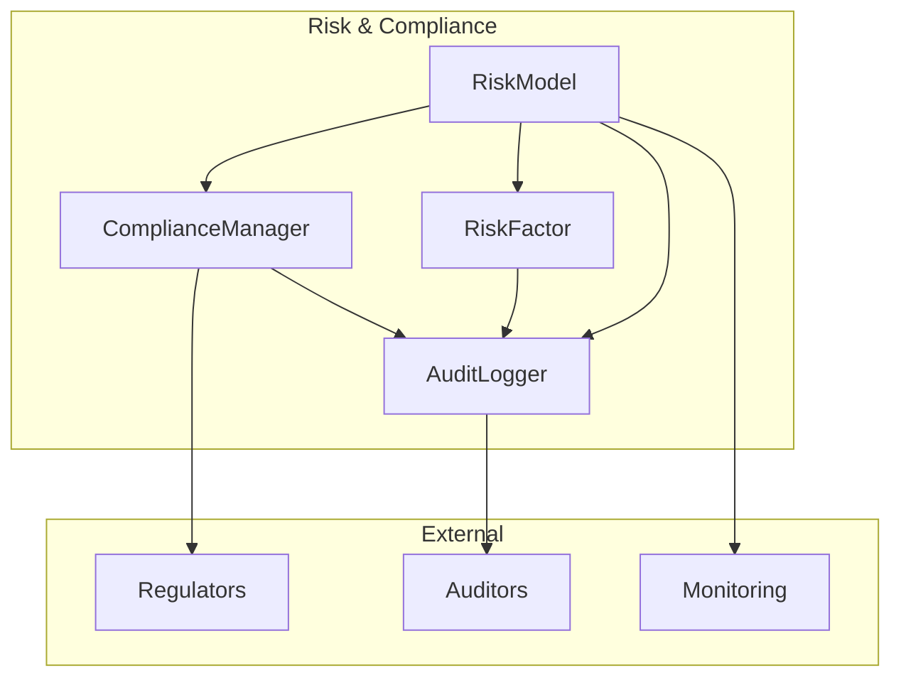
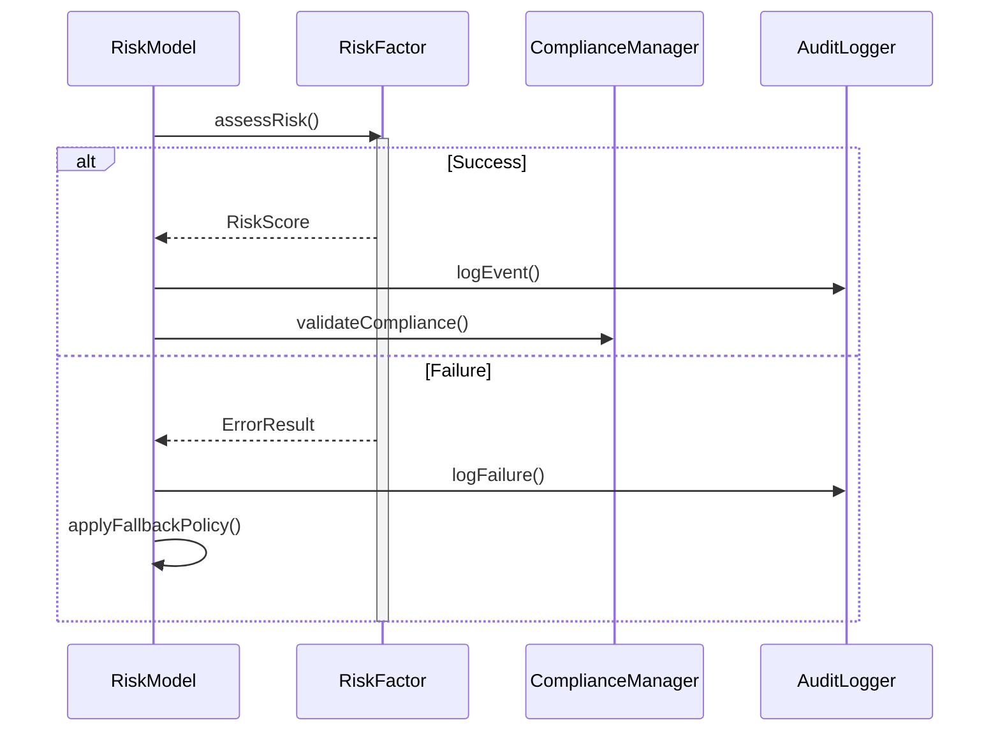
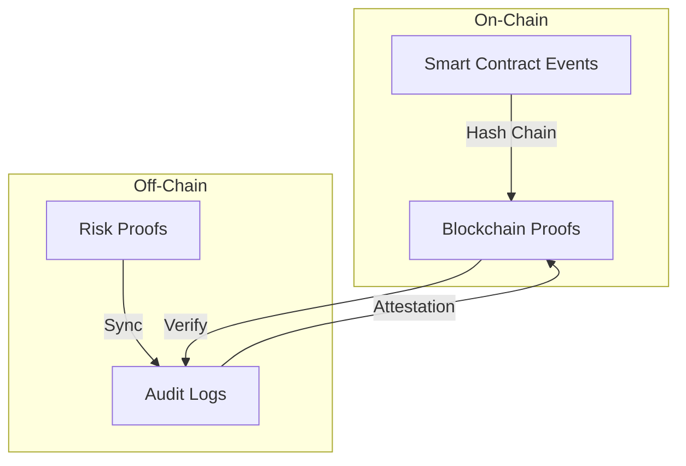

# VeritasVault Artifact 6 – Risk & Compliance Domain (Unified Architecture)

---

## 1. Metadata Block

```yaml
---
document_type: architecture
classification: internal
status: draft
version: 1.0.0
last_updated: 2025-05-24
applies_to: risk-compliance-domain
source_of_truth: true
dependencies:
  - core-infrastructure-v2.1
  - security-framework-v1.5
  - compliance-model-v1.2
reviewers:
  - risk-architecture-board
  - domain-experts
  - security-team-lead
next_review: 2025-06-24
priority: p0
---
```

---

## 2. Executive Summary

### Business Impact

* Ensures institutional-grade, provable risk management, compliance, and audit trails for VeritasVault.
* Delivers regulatory onboarding, reputation defense, and fast incident response.
* Forms a critical foundation for DeFi adoption by traditional finance and regulated entities.

### Technical Impact

* Real-time, multi-factor risk scoring and compliance analysis.
* Immutable, append-only audit logs with cryptographic proofs.
* Modular, DDD-aligned structure for regulatory and technical extension.

### Timeline Impact

* **Phase 1:** Core risk engine, audit logging, and MVP compliance manager (KYC/AML, reporting, event hooks).
* **Phase 2:** Advanced analytics, compliance automation, flexible reporting.
* **Phase 3:** Regulator integration, real-time analytics, dispute resolution.
* **Phase 4:** Cross-chain and AI/ML-driven risk/compliance modules.

---

## 3. Domain Overview

The Risk & Compliance domain is the protocol's control center for risk, compliance, and full event traceability. Every protocol action is scored, logged, and—where required—escalated for compliance and audit.

---

## 4. Responsibilities & Boundaries

### Core Functions

* Risk scoring and profile management
* Immutable audit/event logging
* Regulatory compliance (KYC/AML, automated reporting)
* Protocol-wide incident and escalation hooks
* Exportable audit/compliance records

### Scope Definition

* **In Scope:** RiskModel, RiskFactor, ComplianceManager, AuditLogger, scoring, KYC/AML, audit trail, reporting, event hooks
* **Out of Scope:** Dispute automation, AI-driven analytics, future external modules (tracked as dependencies)

---

## 5. Domain Model Structure (DDD)

### Aggregate Roots

* **RiskProfile:** Aggregates all risk assessments, scoring, escalation state.
* **AuditRecord:** Aggregates all event/audit logs and protocol links.
* **ComplianceCase:** Aggregates KYC/AML, compliance actions, reporting.

### Entities

* **RiskAssessment:** Individual event or transaction risk score, multi-factor.
* **RiskFactor:** Modular analysis unit (market, counterparty, oracle, contract).
* **ComplianceReport:** Periodic or ad-hoc compliance result.
* **AuditEntry:** Immutable event log record.

### Value Objects

* **RiskScore:** { type, value, confidence, timestamp }
* **ComplianceRule:** Configurable trigger or enforcement rule.
* **Signature:** Cryptographic proof for audit entry.

### Domain Events

* **RiskAssessed:** Profile update/trigger.
* **AuditLogAppended:** New event added to log.
* **ComplianceReportGenerated:** Compliance status/report issued.
* **IncidentEscalated:** Protocol incident flagged for review.

### Repository Contracts

* **IRiskProfileRepository:** Score/lifecycle management.
* **IAuditRecordRepository:** Immutable audit log management.
* **IComplianceCaseRepository:** Compliance lifecycle, reporting, KYC.

### Invariants / Business Rules

* No protocol state change without audit entry.
* All events/transactions receive risk scoring.
* All compliance cases require full KYC/AML and signed closure.
* Audit logs must be cryptographically verifiable and append-only.

---

## 6. Unified Interfaces & Example Code

```typescript
interface IRiskModel {
    assessRisk(target: Target): Promise<RiskAssessment>;
    getRiskProfile(target: Target): Promise<RiskProfile>;
    updateRiskPolicy(policy: RiskPolicy): Promise<void>;
    getAssessmentHistory(target: Target): Promise<RiskAssessment[]>;
}

interface IRiskFactor {
    evaluateRisk(source: RiskSource): Promise<RiskScore>;
    updateFactorWeights(weights: FactorWeights): Promise<void>;
    getFactorHistory(source: RiskSource): Promise<RiskScore[]>;
}

interface IAuditLogger {
    logEvent(event: AuditEvent): Promise<void>;
    getAuditTrail(target: Target): Promise<AuditEntry[]>;
    generateProof(eventId: EventId): Promise<CryptographicProof>;
    verifyProof(proof: CryptographicProof): Promise<boolean>;
}

interface IComplianceManager {
    enforceKYC(user: Address): Promise<KYCStatus>;
    generateComplianceReport(period: TimePeriod): Promise<ComplianceReport>;
    enforceRules(target: Target): Promise<ComplianceResult>;
    updateRules(rules: ComplianceRules): Promise<void>;
}
```

---

## 7. Implementation Patterns & Visuals

### Component Relationships & Data Flow



### Domain Event Flow & Error Handling



### Error Handling Patterns

```typescript
interface ErrorResult {
  code: ErrorCode;
  severity: ErrorSeverity;
  retryable: boolean;
  context: ErrorContext;
  timestamp: DateTime;
}

interface FaultTolerance {
  readonly maxRetries: number;
  readonly backoffStrategy: BackoffStrategy;
  readonly circuitBreakerConfig: CircuitBreakerConfig;
  handleError(error: ErrorResult): Promise<void>;
  applyFallbackPolicy(): Promise<void>;
  notifyStakeholders(error: ErrorResult): Promise<void>;
}
```

### Regulatory Standards Mapping

| Component     | Standard    | Requirement       | Implementation                           |
| ------------- | ----------- | ----------------- | ---------------------------------------- |
| AuditLogger   | SEC 17a-4   | Immutable Records | Append-only logs, cryptographic proofs   |
| ComplianceMgr | MiCA Art 30 | Risk Monitoring   | Real-time assessment, reporting          |
| RiskModel     | ISO 31000   | Risk Framework    | Structured assessment, policy management |
| RiskFactor    | Basel III   | Risk Categories   | Modular risk-source analytics            |

### Deployment Phasing & Success Criteria

**Phase 1: Core Infrastructure**

* Deploy AuditLogger, RiskFactor, foundational RiskModel.
* **Metrics:** <5s risk assessment, 100% audit log coverage, no data loss.
* **Rollback:** >10s latency, audit log inconsistency, >5m component outage.

**Phase 2: Compliance & Reporting**

* Deploy ComplianceManager, rule engine, reporting infra.
* **Metrics:** <30s report gen, live compliance status, regulatory exports.
* **Rollback:** Failed export, >1m rule delay, report gen failure.

**Phase 3: Advanced Automation**

* Real-time analytics, regulator integration, predictive risk, dispute mgmt.
* **Metrics:** SLA-defined, automated alerting, regulator hand-off.

### On/Off-chain Event Reconciliation



### Upgrade & Migration Patterns

```typescript
interface UpgradeableContract {
  readonly version: string;
  readonly upgradeHistory: UpgradeRecord[];
  prepareUpgrade(): Promise<void>;
  validateState(): Promise<boolean>;
  migrateData(newSchema: Schema): Promise<void>;
  rollbackUpgrade(): Promise<void>;
}
```

---

## 8. Security & Threat Considerations

| Threat Type            | Vector/Scenario                  | Mitigation/Control                             |
| ---------------------- | -------------------------------- | ---------------------------------------------- |
| Risk Model Evasion     | Manual overrides, hidden flows   | Immutable logs, signed attestations            |
| Audit Tampering        | Log manipulation, silent edit    | Append-only, cryptographic proofs, access logs |
| Compliance Gaps        | Out-of-date rules, missed events | Policy versioning, automated triggers          |
| Data Retention Failure | Silent deletes, selective loss   | Tamper-proof storage, regular audits           |

---

## 9. Integration Points

* Risk and audit logs plug into core infra (Ops, Security, Analytics)
* ComplianceManager accessible to external regulators
* Reports exportable in PDF, JSON, XBRL
* Real-time event streaming to monitoring and compliance systems

---

## 10. Document Control

* **Owner(s):** Risk & Compliance Architect
* **Last Reviewed:** 2025-05-24, by Risk Board
* **Change Log:**

  | Version | Date       | Author         | Changes       | Reviewers      |
  | ------- | ---------- | -------------- | ------------- | -------------- |
  | 1.0.0   | 2025-05-24 | Risk Architect | Unified draft | Domain Experts |
* **Review Schedule:** Quarterly, or after major protocol change.

---

**This document is the SINGLE source of truth for the VeritasVault risk, compliance, and audit domain. All technical, operational, and reporting references must be aligned here before deployment or integration.**
